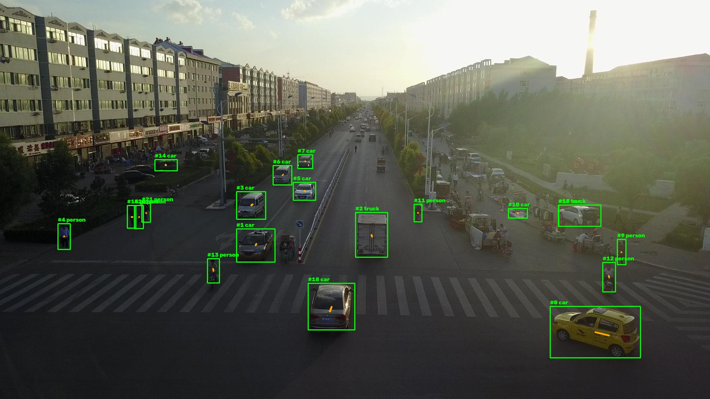
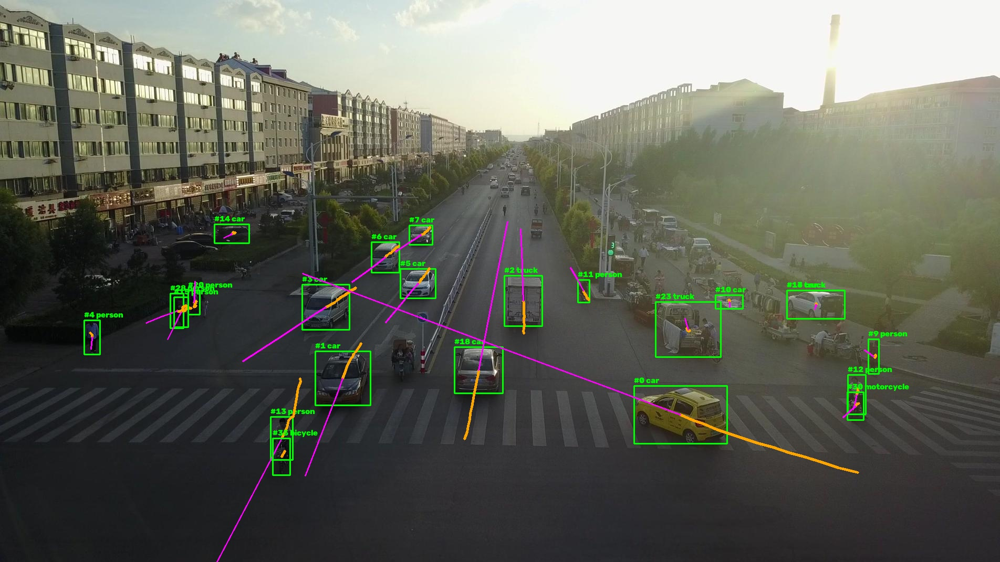
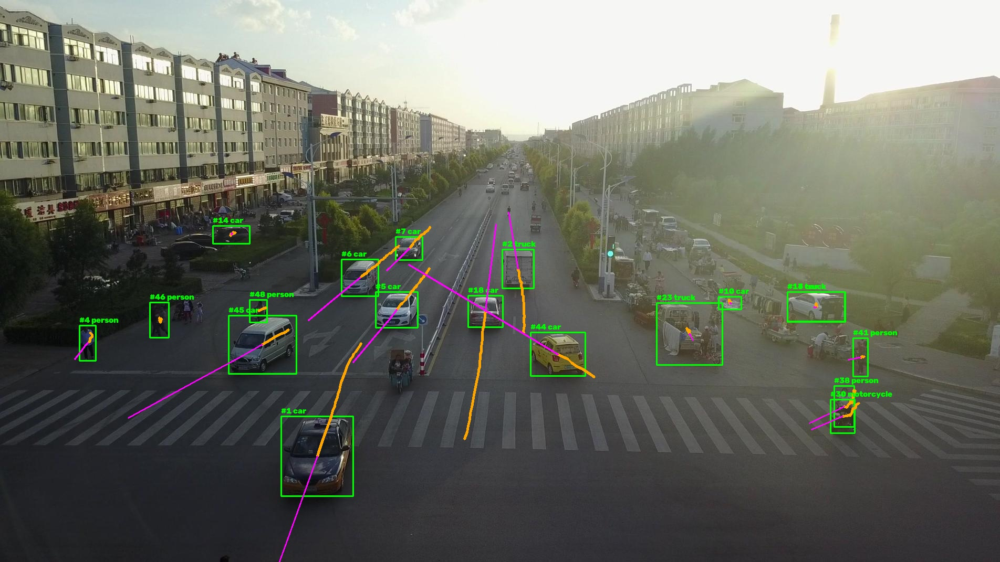

# Multi Target Motion Tracking & Intercept Trajectory Estimator

A modern perception pipeline that detects objects in aerial video, tracks them with persistent identities across frames, and estimates where they will be several frames into the future. 

Built on VisDrone2019-MOT — drone footage of road scenes, annotated for multi-object tracking.


# What it does so far



# Architecture


#TODO: try to recreate uml in digital format  
## Data types
| Type | Represents | Key fields |
|------|-----|------|
| `Detection` | one object in one frame | `bbox, confidence, class_id, class_name, frame_id` |
| `Track` | 25 | `track_id, history: list[Detection], frames_since_update `|
| `Prediction` | one future estimate | `track_id, frame_id, horizon, point` |
| `PipelineState` | everything about one frame | the three lists above, plus the frame itself |

## Key Methods
- Detection:
- Tracking:
- Prediction:


# Project Structure
```text
scripts/
  - run_pipeline.py
src/
  core/
    - base_module.py
    - coordinator.py
    - datatypes.py
  data_scan/
    - recorder.py
    - video_source.py
    - visualizer.py
  module/
    detector/
      - yolo_detector.py
    predictor/
      - constant_velocity.py
    tracker/
      - iou_tracker.py
    intercept/ # not written yet
```

# How to Run
```bash
python3 -m venv .venv
source .venv/bin/activate
pip install -r requirements.txt

python -m scripts.run_pipeline --sequence data/visdrone/VisDrone2019-MOT-val/sequences/uav0000339_00001_v
python -m scripts.evaluate
```

# What has to be fixed

Frame 30

Frame 36

We can see a sudden change in our tracking which is caused by the sudden drop of the drone view. The tracking does not calculate the movement of the camera itself which leads to a sudden change of the position


# Tech Stack

|   |   | 	    |
|------|-----|------|
| Python | 	3.10+ | dataclasses, generators, pathlib, stdlib csv |
| ultralytics | ≥ 8.0 | YOLOv8m object detection |
| PyTorch | via ultralytics | model inference; CPU only in this project |
| OpenCV | 	≥ 4.8 | reading frames, drawing boxes, labels, trails and paths |
| NumPy | ≥ 1.24 | frames as arrays, coordinate arithmetic | 
| pandas | ≥ 2.0 | the join and group-by in `evaluate.py` |
| matplotlib | ≥ 3.7 | plotting during development |


# Data sources & acknowledgements
- VisDrone dataset — aerial imagery used throughout this project. Provided by the AISKYEYE team at the Lab of Machine Learning and Data Mining, Tianjin University. Project: https://github.com/VisDrone/VisDrone-Dataset